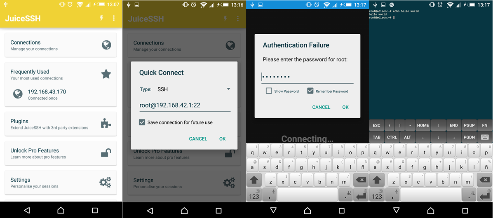
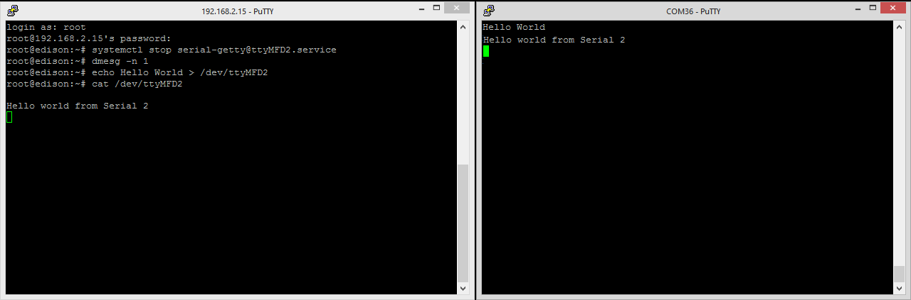

# Edison Getting Started (Windows)
It is important to mention that this board works without problems in a Linux Environment as well; but this tutorial focuses in Windows.  

First of all, you will need to get some drivers installed so you don't have any issues. 
> Do this **BEFORE** you plug your board in!

#### SETUP
1. Go to [This](https://software.intel.com/en-us/iot/hardware/edison/downloads) page and get the **[Driver Software](http://downloadmirror.intel.com/24909/eng/IntelEdisonDriverSetup1.2.1.exe)**. It is the file: **IntelEdisonDriverSetup1.2.1.exe**
> Follow These Steps: <br/>
>  <br/>
----------
>  <br/>
----------
>  <br/>
----------
>  <br/>
----------
>  <br/>
----------

2. Download the **[CDM FTDI Driver](http://www.ftdichip.com/Drivers/CDM/CDM%20v2.10.00%20WHQL%20Certified.exe)** 
> Follow These Steps: <br/>
>  <br/>
----------
>  <br/>
----------

3. Connect Both USB Cables to The Board
4. Open Windows **Device Manager**
5. Under **Ports (COM & LPT)** you should see the COM of your EDISON
> If you cannot see the Proper COM as in the last picture try the following: <br/>
>  <br/>
----------
>  <br/>
----------
>  <br/>
----------
>  <br/>
----------
>  <br/>
----------
>  <br/>
----------

6. Under **Network Adapters** you should see the Intel Edison **RNDIS** Adapter
> If you cannot see the Proper COM as in the last picture try the following: <br/>
>  <br/>
----------
>  <br/>
----------
>  <br/>
----------
>  <br/>
----------
>  <br/>
----------

#### Serial Connection
1. Open Putty, under the serial Connection Write the **COM** That was assigned to the edison FTDI adapter. We must use the **USB Serial PORT**; not the **Virtual COM Port** since this is the one that the Arduino IDE uses. The BAUD is **115200** 
>Reference: <br/>
>  <br/>
----------

2. Edison login: **root** 
3. Now you can have access to the Linux Yocto OS

#### SSH Connection (RNDIS)
1. Open Network and Sharing Center<br/>
>  <br/>
----------

2. Change adapter settings<br/>
>  <br/>
----------

3. If Disabled, **Enable** the RNDIS Network Adapter<br/>
>  <br/>
----------

4. Go To The Adapter Properties and double click the **Internet Protocol Version 4 (TCP/IPv4)** option<br/>
>  <br/>
----------

5.  Use These parameters for the **Static IPv4** Address and click OK<br/>
>  <br/>
----------

5.  Go to Putty and Select SSH Configuration using these Parameters<br/>
>  <br/>
----------

6.  Click YES<br/>
>  <br/>
----------

7. Edison login: **root** 
8. Now you can have access to the Linux Yocto OS

#### SSH File Explorer
1. Download [WinSCP](https://winscp.net/eng/download.php)
2. Open WinSCP and add a New Site with these Parameters (If your Edison has no password, leave that field blank)<br/>
>  <br/>
----------

3. Add This Key to WinSCP<br/>
>  <br/>
----------

3. You Should now have access to the Files with GUI<br/>
>  <br/>
----------

#### Android/Windows - Wifi SSH 
1. Download the App JuiceSSH
2. Configure The Edison Name and Password. I suggest you only change to password to **password**
```
configure_edison --setup
```

3. Start AP Mode. The Second command is to stop that service
```
systemctl start hostapd
systemctl stop hostapd
```

> Because the Broadcom module does not support STA/AP concurrently, hostapd and wpa_supplicant
cannot run simultaneously. Use the following commands to start/stop wpa_supplicant manually: 
```
systemctl start wpa_supplicant
systemctl stop wpa_supplicant
```

4. Scan with yout Phone (or computer) for WIFI
5. It should be called Something like EDISON:XX:XX
6. The password is the same one as assigned in step **2**

> In case you want to know the default wifi password before you set it up you must use your Edison Serial number, and it should be something like this: **FZED443D01RNZ501**. This can be found in the Box or:
```
cat /etc/hostapd/hostapd.conf | grep wpa_passphrase
```

7. Now you need to know the Edison IP to access by SSH
```
ifconfig
```

>  <br/>
----------

8. Open JuiceSSH and connect like this:

>  <br/>
----------

> Instead of using JuiceSSH you can just using Putty in Windows

9. You can as well access the archives with a GUI in Android. Donwload **File Explorer** App
10. Follow These Steps:<br/>

>  <br/>
----------

#### Interact with Serial 2
As you should know, the Edison's **SERIAL2** is actually the **Linux Serial terminal**; it is connected to the uUSB connector with an FTDI chip, so if you are planning in using the SERIAL2, things might get a bit complicated. I will explain how can you achieve such connection and get the right communication noise free!<br/>

1. Connect both uUSB cables to your computer. <br/>
2. Connect the Edison through COM and SSH in 2 Putty sessions<br/>

>  <br/>
----------

3. Type these Commands in the SSH Session (it has to be in the SSH session because once the first command is executed, the terminal will be disabled and you will not be able to input the second one):
```
systemctl stop serial-getty@ttyMFD2.service
dmesg -n 1
```

4. Test your connection with an echo, you should see something like this (rememebr that the serial2 is in **/dev/ttyMFD2**):
```
echo Hello World > /dev/ttyMFD2
```

>  <br/>
----------

5. Test the connection from the Device to the Edison:<br/>

>  <br/>
----------